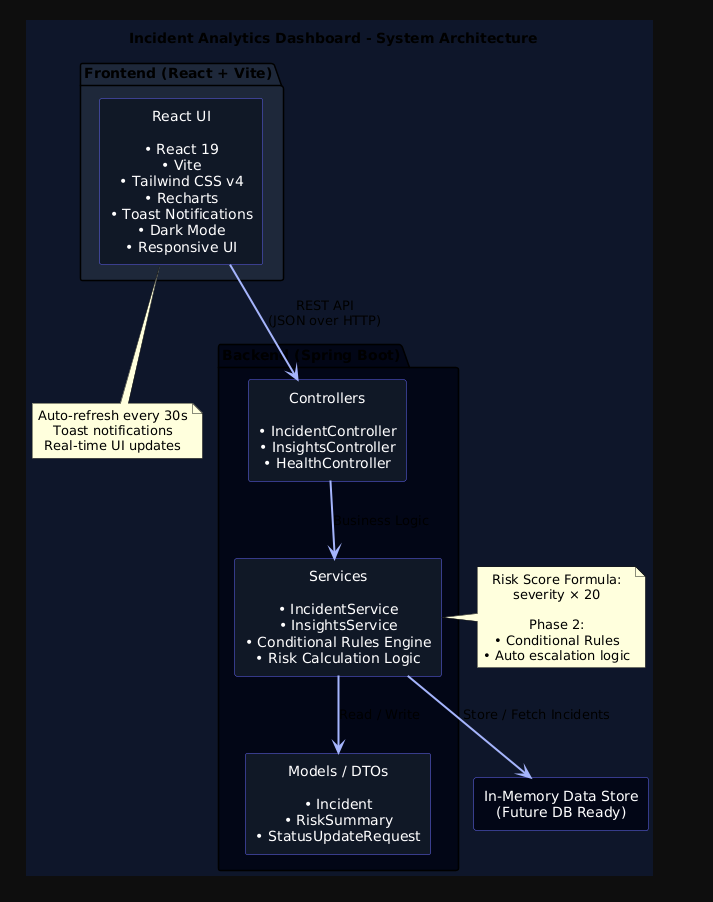

# System Architecture

This document describes the high-level architecture of the **Incident Analytics Dashboard**.

The application follows a clean, layered full-stack architecture where a React frontend communicates with a Spring Boot backend through RESTful APIs.

---

## Architecture Diagram

---

## Frontend (React + Vite)

**Responsibilities**
- Render analytics dashboards and charts
- Handle user interactions (create, acknowledge, resolve incidents)
- Display real-time updates and notifications
- Manage application state and UI logic

**Technologies**
- React 19
- Vite
- Tailwind CSS v4
- Recharts
- Lucide React
- Custom Toast Notification System

---

## Backend (Spring Boot)

**Responsibilities**
- Expose RESTful API endpoints
- Manage incident lifecycle and state transitions
- Calculate risk scores and analytics
- Apply conditional business rules

**Layers**
- **Controllers**: API endpoints (Incident, Insights, Health)
- **Services**: Business logic and analytics calculations
- **Models / DTOs**: Incident, RiskSummary, StatusUpdateRequest
- **Storage**: In-memory data store (database-ready design)

---

## Data Flow

1. User interacts with the dashboard UI
2. Frontend sends HTTP requests (JSON)
3. Spring Boot controllers receive requests
4. Services process logic and rules
5. Data is returned to the frontend
6. UI updates automatically with animations and charts

---

## Design Principles

- Separation of concerns (Controller / Service / UI)
- Extensible architecture (rules engine, DB, integrations)
- Real-world incident management workflow
- Maintainable and readable codebase
